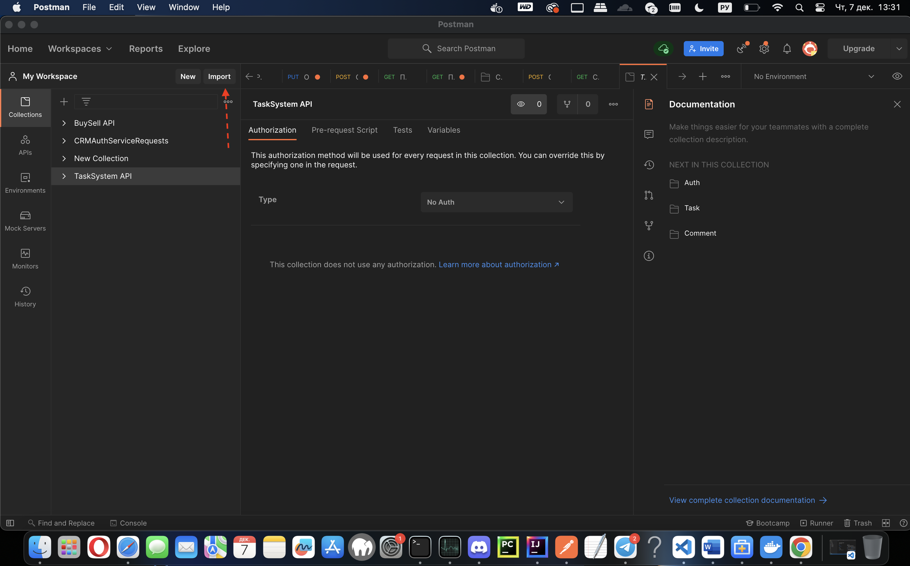
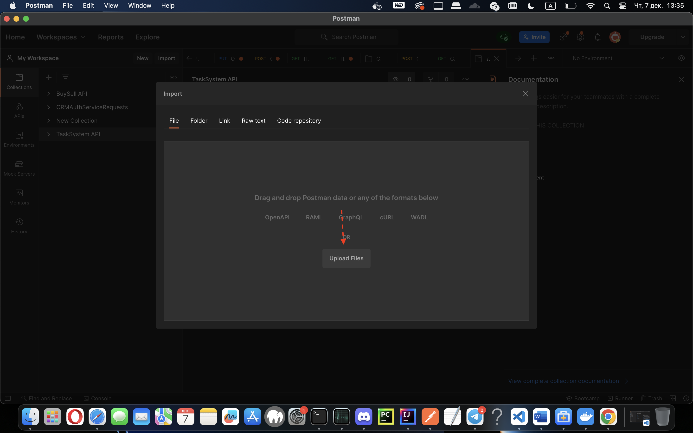

# Task Management System

Простая система управления задачами с использованием Java и Spring.

## Требования

- Docker
- Docker Compose

## Запуск

1. Клонируйте репозиторий:

```bash
git clone https://github.com/yourusername/task-management-system.git
```

2. Перейдите в каталог проекта:
```bash
cd task-management-system
```

3. Запустите приложение с помощью Docker Compose:
```bash
docker-compose up --build
```

Это создаст и запустит контейнеры для приложения и базы данных.

Приложение будет доступно по адресу http://localhost:8080.

## Использование

1. Откройте postman и импортируйте Postman коллекию с каркасом всех доступных запросов в API  .

2. Зарегистрируйтесь или войдите в систему существующим аккаунтом.

3. Создайте новые задачи, редактируйте, удаляйте, меняйте статус и просматривайте задачи, а так же создавайте и просматривайте комментарии.

## Остановка

Чтобы остановить приложение и удалить контейнеры, выполните следующую команду в корневом каталоге проекта:

```bash
docker-compose down
```

## Замечания

Если вы внесли изменения в код, пересоберите образ Docker перед повторным запуском:
```bash
docker-compose up --build
```

Убедитесь, что порты 8080 (приложение) и 5432 (PostgreSQL) доступны на вашей машине.

## Тестирование

Для того что бы запустить все тесты, нужно запустить Docker контейнер
```bash
docker-compose up --build
```

После этого, в терминале из корневой папки с проектом введите эту команду
```bash
./gradlew test
```

## Тестирование запросов API

Для вашего удобства я подготовил Postman коллекцию со всеми запросами в приложениии, вам остается только подставлять свои данные

1. Откройте Postman
2. Нажмите кнопку Import
   

3. Загрузите сюда файл **"TaskSystem API.postman_collection.json"**, который находитсья в корневой папке с проектом

